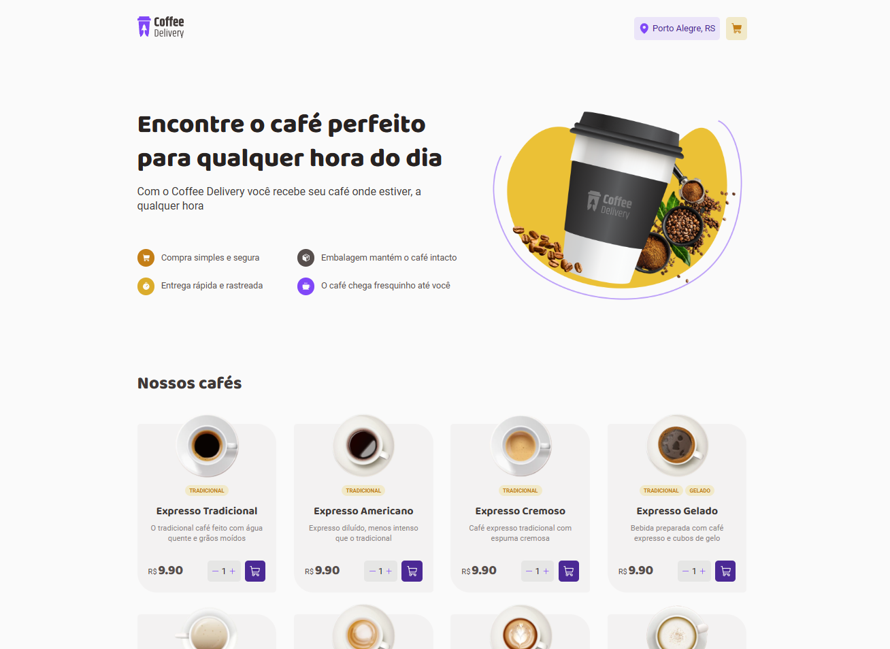
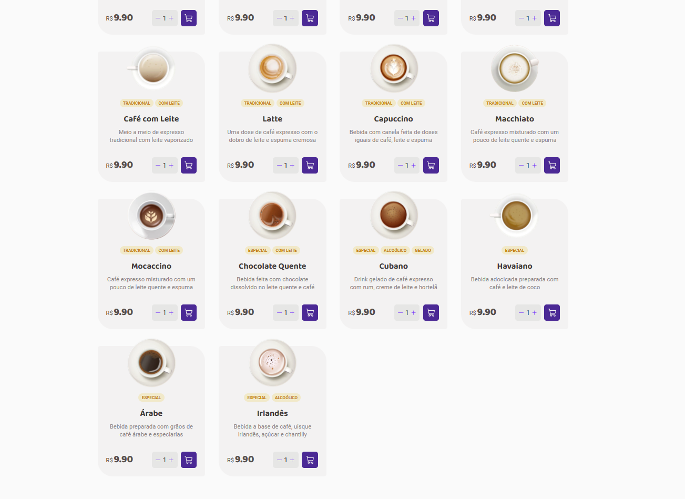
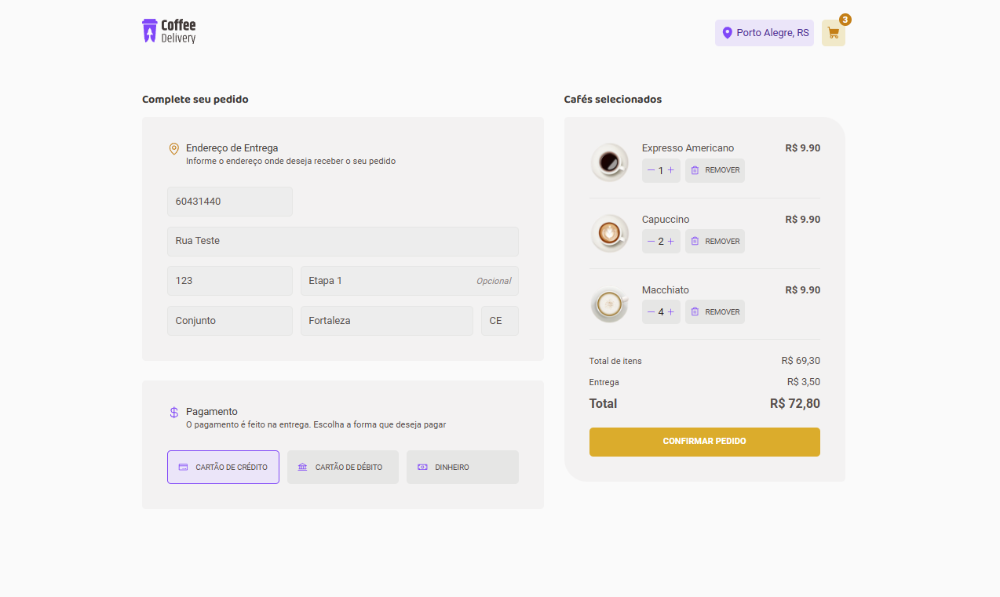
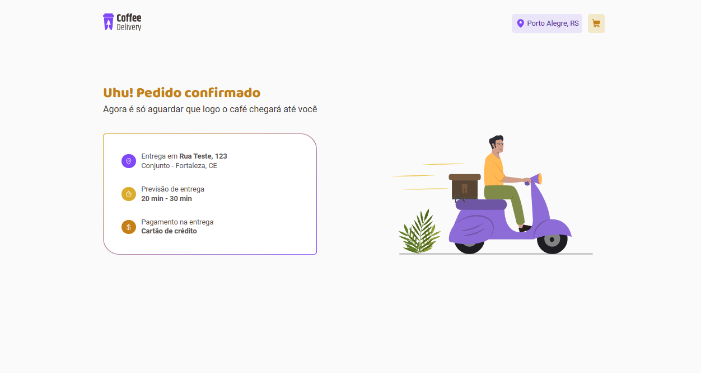

# Coffee Delivery

Aplicação React para gerenciar um carrinho de compras de uma cafeteria fictícia, que contém as seguintes funcionalidades::

- Listagem de produtos (cafés) disponíveis para compra
- Adicionar uma quantidade específicas de itens no carrinho
- Aumentar ou remover a quantidade de itens no carrinho
- Formulário para o usuário preencher o seu endereço
- Exibir o total de itens no carrinho no Header
- Exibir o valor total da soma de itens no carrinho multiplicados pelo valor

Foi criada com Vite (https://vitejs.dev/) usando o template de TypeScript.

Esta aplicação utiliza os seguintes conhecimentos de React:

- Estados
- ContextAPI
- LocalStorage
- Imutabilidade do estado
- Listas e chaves no ReactJS
- Propriedades
- Componentização

## Bibliotecas utilizadas

- [@hookform/resolvers] (https://www.npmjs.com/package/@hookform/resolvers)
- [@phosphor-icons/react] (https://www.npmjs.com/package/@phosphor-icons/react)
- [@rocketseat/eslint-config] (https://github.com/Rocketseat/eslint-config-rocketseat)
- [immer] (https://www.npmjs.com/package/immer)
- [react-hook-form] (https://www.npmjs.com/package/react-hook-form)
- [react-router-dom] (https://www.npmjs.com/package/react-router-dom)
- [styled-components] (https://www.npmjs.com/package/styled-components)
- [zod] (https://www.npmjs.com/package/zod)

## Para executar a aplicação

Baixar dependências:

```shell
npm i
```

Executar o comando:

```shell
npm run dev
```

## Telas

### Página Home





### Tela Checkout



### Tela Success


